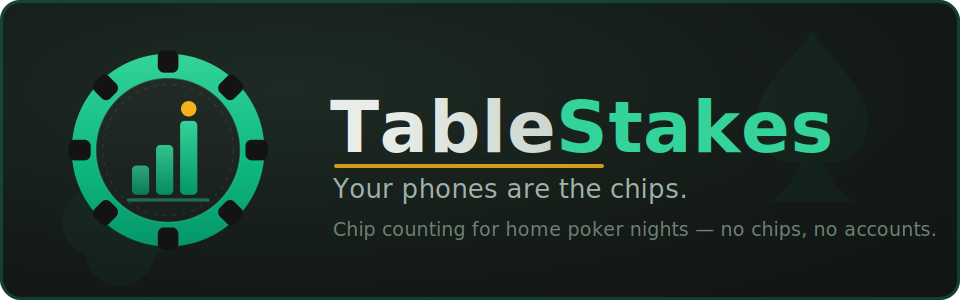

<p align="center">
  
</p>

# TableStakes

**Poker night, without the chips.** One laptop hosts the table; everyone's phone becomes their chip stack. TableStakes keeps count of every bet, pot, side pot, and rebuy — and at the end of the night it tells you exactly who pays whom.

You bring the cards and the people. TableStakes handles the money.

- 🃏 **You still play real poker** — real cards, real reads, real table talk. The app never deals a card or judges a hand; it only does the chip math.
- 📱 **No chips to buy, count, or argue about** — your phone shows your stack and three big buttons: fold, call, raise.
- 🏠 **Everything stays in your home** — runs on your own Wi-Fi, no internet needed, no accounts, no app store, nothing to install on phones.
- 💶 **Honest to the cent** — buy-ins, rebuys, and the final settlement always add up. The app literally cannot lose a chip.

## Start a game night

You need one computer (Mac, Windows with WSL, or Linux) with [Node.js 22+](https://nodejs.org) — click the LTS button, install, done. Then:

```bash
git clone https://github.com/Skeptomenos/TableStakes.git
cd TableStakes
./start.sh
```

That's it. The first run installs and builds (a minute or two); after that it starts in seconds. Your terminal will show a QR code:

```
  ♠ TableStakes — your phones are the chips
  ────────────────────────────────────────────────
  1. Keep this window open — it is the table.
  2. The table console opens in your browser:
     set the buy-in and blinds, hit Create.
  3. Players: scan this with your phone camera —

     █▀▀▀▀▀█ ▀▄█▀▄ █▀▀▀▀▀█
     █ ███ █ ▀▄▄▀▄ █ ███ █     ← everyone scans,
     █ ▀▀▀ █ █▄ ▀█ █ ▀▀▀ █       everyone's in
     ▀▀▀▀▀▀▀ ▀ ▀ ▀ ▀▀▀▀▀▀▀
```

Players scan the QR with their phone camera (or type the short address), pick a name, grab a seat, and confirm the buy-in. No downloads, no sign-ups — it opens right in the phone browser.

## How a night works

1. **The laptop is the table.** Its console sets the stakes once — buy-in (say €10 = 1000 chips) and blinds — and shows the join QR all night. Everyone buys in for the same amount with one tap on their phone; once two players are seated, pick the first dealer and deal.
2. **Play your cards.** The app posts blinds, tracks whose turn it is, and totals the pot live in the middle of the table screen. Your phone shows your stack and your options — tap Call, tap Raise, drag the slider for a big move. Fold and all-in ask "are you sure?" — everything else is one tap.
3. **Let it do the hard math.** Three people all-in with different stacks? Side pots are built and settled in order, automatically. Split pot? Enter the split, the app checks it to the chip.
4. **Life happens, the game doesn't stop.** Phone died mid-hand? Your seat and stack wait for you — scan back in and you're where you were. Someone heads home early? Release their seat; their chips stay counted for the payout. Fat-fingered a bet? One tap of Undo reverses the last action for the whole table.
5. **Cash out without arguments.** Tap "Finish Game" and TableStakes shows everyone's buy-ins, final chips, and net result — then the shortest list of who-pays-whom (usually one or two payments, not a spreadsheet). It always balances to the cent.

## What it supports

| At the table | Money & rules | Keeping the night safe |
|---|---|---|
| 2–10 players | Fixed buy-in for all, rebuys up to the buy-in | Reconnect to your seat after phone sleep |
| Blinds, checks, bets, raises, all-ins | Choose your raise rules: anything-goes, double, or standard | Undo the last action, table-visible |
| Side pots, split pots, settlement in order | Strict mode for by-the-book games (off by default) | Chip corrections when reality and app disagree |
| Live pot & turn tracking on every phone | End-of-night settlement, minimized payments | Games survive laptop restarts |
| Dealer button & blind rotation | Game history & per-player stats across nights | Every action logged and auditable |

**What it deliberately doesn't do:** deal cards, rank hands, or run tournaments with blind timers. TableStakes is for cash-game home poker where the cards are real and the chips are the annoying part.

## Good to know

- **Playing tips:** phones work best in portrait (the app will nudge you). Any phone with a browser works — iPhone, Android, whatever.
- **Where's my data?** In a single file on the host laptop (`data/` folder). No cloud, no telemetry, nothing leaves your house.
- **Same address every time?** Your game history and player stats reappear whenever you start TableStakes on the same laptop.
- **Something looks wrong mid-hand?** The Manage button on every phone has the fix: undo, correct chips, hand the turn to the right player, or cancel the hand and redeal — every fix is visible to the whole table.

## For contributors

TableStakes is TypeScript end to end, with a deliberately serious test suite for something so fun (330+ tests — the chip math is real money math). Architecture, development setup, validation gate, and contribution flow live in [CONTRIBUTING.md](CONTRIBUTING.md).
